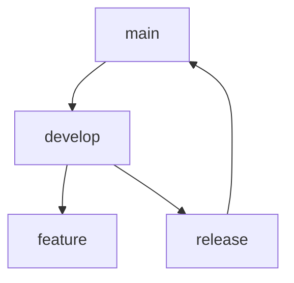

## Git 고급 기능

### Rebase vs Merge

rebase와 merge의 차이점과 각각 언제 사용해야 하는지 알아봅시다.

```bash
# merge 예제
git checkout main
git merge feature

# rebase 예제
git checkout feature
git rebase main
```

## Git Flow 전략



### 유용한 Git 명령어

```bash
# 특정 커밋 되돌리기
git revert <commit-hash>

# 이전 커밋 수정
git commit --amend

# 특정 파일의 변경 이력 확인
git log -p <file>
```
