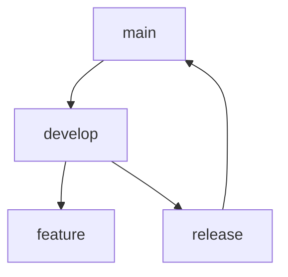

---

title: "자바스크립트 async/await 완벽 가이드"
description: "자바스크립트의 비동기 처리 패턴인 async/await의 개념과 실제 사용법을 알아봅니다."
date: "2024-03-19"
tags: ["JavaScript", "async/await", "비동기처리"]

---

## async/await이란?

async/await은 Promise를 더 쉽게 사용할 수 있게 해주는 문법적 설탕(Syntactic sugar)입니다.

### 기본 문법

```javascript
async function getData() {
  try {
    const response = await fetch("https://api.example.com/data");
    const data = await response.json();
    return data;
  } catch (error) {
    console.error("Error:", error);
  }
}
```

## 주요 특징

1. 비동기 코드를 동기 코드처럼 작성할 수 있습니다.
2. try/catch를 통한 에러 처리가 가능합니다.
3. Promise chain보다 가독성이 좋습니다.

## 실제 사용 예제

```javascript
async function getUserData() {
  const user = await getUser(1);
  const posts = await getPosts(user.id);
  const comments = await getComments(posts[0].id);

  return {
    user,
    posts,
    comments,
  };
}
```

````

```markdown:content/react-hooks-guide.md
---
title: "React Hooks 완벽 가이드"
description: "React의 기본적인 Hook들의 사용법과 커스텀 Hook 만드는 방법을 알아봅니다."
date: "2024-03-18"
tags: ["React", "Hooks", "Frontend"]
---

## React Hooks 소개

Hook은 React 16.8에서 도입된 기능으로, 클래스 컴포넌트 없이 상태와 생명주기 기능을 사용할 수 있게 해줍니다.

### useState

```jsx
function Counter() {
    const [count, setCount] = useState(0);

    return (
        <button onClick={() => setCount(count + 1)}>
            Count: {count}
        </button>
    );
}
````

### useEffect

```jsx
useEffect(() => {
  document.title = `Count: ${count}`;
}, [count]);
```

## 커스텀 Hook 만들기

```jsx
function useWindowSize() {
  const [size, setSize] = useState({
    width: window.innerWidth,
    height: window.innerHeight,
  });

  // ... 구현 내용
}
```

````

```markdown:content/typescript-basic.md
---
title: "TypeScript 기초부터 실전까지"
description: "TypeScript의 기본 문법과 실제 프로젝트에서의 활용법을 다룹니다."
date: "2024-03-17"
tags: ["TypeScript", "JavaScript", "개발환경"]
---

## TypeScript란?

TypeScript는 JavaScript에 타입을 추가한 언어입니다. Microsoft에서 개발했으며, 대규모 애플리케이션 개발에 매우 유용합니다.

### 기본 타입

```typescript
// 기본 타입 선언
let name: string = "홍길동";
let age: number = 25;
let isStudent: boolean = true;

// 배열
let numbers: number[] = [1, 2, 3, 4, 5];
let names: Array<string> = ["홍길동", "김철수"];

// 객체
interface User {
    name: string;
    age: number;
}
````

## 제네릭 사용하기

```typescript
function getFirstElement<T>(arr: T[]): T {
  return arr[0];
}
```

````

```markdown:content/docker-basic.md
---
title: "Docker 기초 가이드"
description: "Docker의 기본 개념과 명령어, 실제 활용 사례를 알아봅니다."
date: "2024-03-16"
tags: ["Docker", "DevOps", "컨테이너"]
---

## Docker란?

Docker는 애플리케이션을 컨테이너화하여 개발, 배포, 실행을 더 쉽게 만들어주는 도구입니다.

### 기본 명령어

```bash
# 이미지 다운로드
docker pull ubuntu:latest

# 컨테이너 실행
docker run -d -p 80:80 nginx

# 컨테이너 목록 확인
docker ps
````

## Dockerfile 작성하기

```dockerfile
FROM node:14
WORKDIR /app
COPY package*.json ./
RUN npm install
COPY . .
EXPOSE 3000
CMD ["npm", "start"]
```

### Docker Compose 사용법

```yaml
version: "3"
services:
  web:
    build: .
    ports:
      - "3000:3000"
```

````

```markdown:content/git-advanced.md
---
title: "Git 고급 사용법 마스터하기"
description: "Git의 고급 기능과 실무에서 자주 사용되는 명령어들을 상세히 알아봅니다."
date: "2024-03-15"
tags: ["Git", "버전관리", "협업"]
---

## Git 고급 기능

### Rebase vs Merge

rebase와 merge의 차이점과 각각 언제 사용해야 하는지 알아봅시다.

```bash
# merge 예제
git checkout main
git merge feature

# rebase 예제
git checkout feature
git rebase main
````

## Git Flow 전략



### 유용한 Git 명령어

```bash
# 특정 커밋 되돌리기
git revert <commit-hash>

# 이전 커밋 수정
git commit --amend

# 특정 파일의 변경 이력 확인
git log -p <file>
```

```

이 마크다운 파일들은 다음과 같은 특징을 가지고 있습니다:
1. 각각 다른 주제와 태그
2. 최근 날짜순으로 정렬
3. 코드 블록과 설명이 포함
4. 실제 개발자들에게 유용한 내용

이 파일들을 `content/` 디렉토리에 저장하면 블로그에 표시될 것입니다.
```
